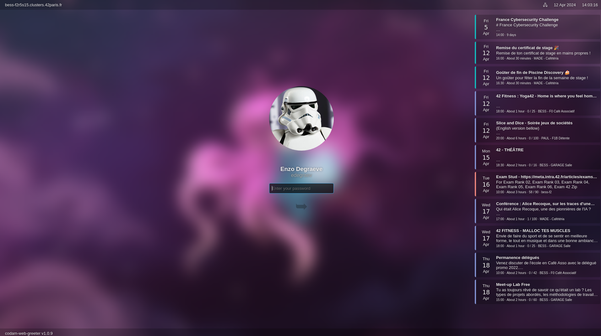

# Pimp my new lock

## Installation

- Create image called `background` on git folder for set background image.
- Run `./install.sh` (`chmod +x install.sh` if needed).
Images can be an animated gif. But video is not supported.

## Todo

- [x] Add custom avatar and background
- [ ] Remove blur background
- [X] Fix avatar image
- [ ] Inject custom css/js
- [ ] Add support for video

## Development and search

- `nody-greeter --debug` for test lock screen
- https://github.com/JezerM/nody-greeter
- https://github.com/codam-coding-college/codam-web-greeter

## Other

Special thanks to [jerem-ma](https://github.com/jerem-ma/) for having the original idea to have created [pimp_my_lock](https://github.com/jerem-ma/pimp_my_lock) !